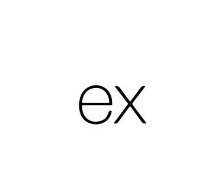

###

  
  

###

  

###

<h1 align="center">hey there 👋</h1>

###

<h3 align="left">👩‍💻  About Me</h3>

###

I'm David Goyal from Punjab,India  - 📚 I'm currently learning Next JS - ⚡ In my free time I learn new stuff. - 📫 How to reach me **goyaldavid55@gmail.com**

###

<h3 align="left">🛠 Language and tools</h3>

###

  
  
  
  
  
  
  
  
  
  
  
  
  
  
  
  
  
  
  
  
  

###

<h3 align="left">🔥   My Stats :</h3>

###

  
  

###

 

###
